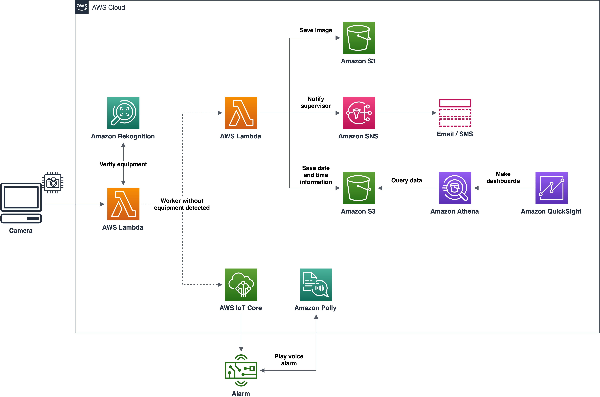
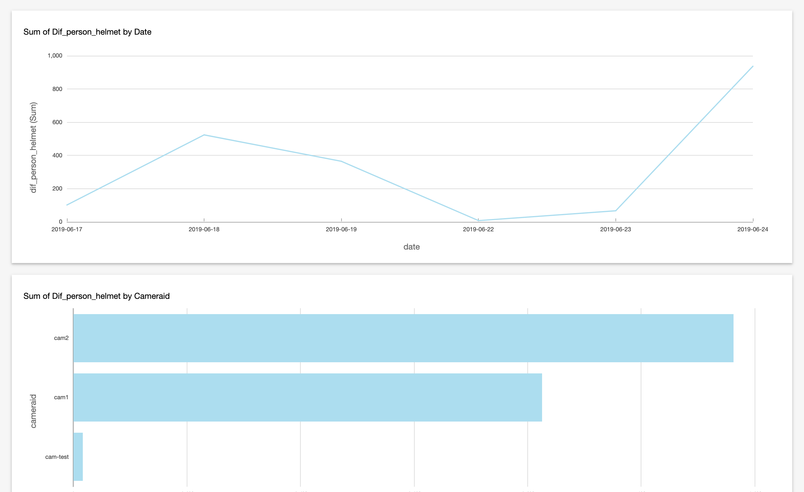

## AWS re:Inforce 2019 PPE Detection Demo

The purpose of Personal Protective Equipment (PPE) is to prevent injuries in the workplace, protect the wearer's body, and reduce exposure to different hazards, such as physical, electrical, chemical, and others. While the usage of such protective gear is essential and legally required in many industry sectors, it is common to see workers forgetting or neglecting the use of PPE.

This demo was presented in the **re:Inforce 2019 Builders Fair** and contains a prototype approach using several AWS services to help prevent accidents in the workplace.



To get started you will need:

- The [AWS CLI](https://aws.amazon.com/cli/) tool installed on your local machine.
- Python 3.7 with [boto3](https://pypi.org/project/boto3/) and [python-opencv](https://pypi.org/project/opencv-python/) libraries installed on your local machine:
    ```
    pip install -r requirements.txt
    ```
- A Raspberry Pi with the [omxplayer](https://www.raspberrypi.org/documentation/raspbian/applications/omxplayer.md) package installed.
- Tested in the N. Virginia region (us-east-1).


## 1. Installation

### 1.1 Create resources on your AWS account

1. Download the .zip or clone this repo on your machine.

2. Make sure you have a user with programmatic access and have configured the access key ID and secret access key.

3. Enter the `deploy` directory and execute `./deploy.sh create`. When asked, set the email address and alarm message (this process will take about 5 minutes to complete, please wait it to finish before proceeding):
    ```
    cd deploy
    ./deploy.sh create
    ```

### 1.2 Configure your Raspberry Pi

Now that you have created the AWS resources in the previous step, you need to upload the certificates and source files to your Raspberry Pi.

1. On the AWS console, go to yours [Things](https://us-east-1.console.aws.amazon.com/iot/home?region=us-east-1#/thinghub) page on the AWS IoT Core service and click on the IoT Thing named `ppe-raspberry-<your_account_id>`.

2. In the left menu, click on Interact, then on Connect a device, and follow the steps to download the connection kit for Linux/OSX and Python SDK.

3. Upload the connection kit .zip and the files from the `src/iot` directory. For example, using scp:

    ```
    scp connect_device_package.zip pi@<your_iot_device_ip>:~
    scp src/iot/subscribe.py pi@<your_iot_device_ip>:~
    scp src/iot/not_protected.ogg pi@<your_iot_device_ip>:~
    ```

4. Login to your Raspberry Pi, unzip the connection kit and modify the `start.sh` to run the demo:

    ```
    unzip connect_device_package.zip
    sed -i 's#python setup.py install#python setup.py install --user#g' start.sh
    sed -i 's#aws-iot-device-sdk-python/samples/basicPubSub/basicPubSub.py#subscribe.py#g' start.sh
    chmod +x start.sh
    ./start.sh
    ```


## 2. Running

1. Make sure the `./start.sh` script is still running in your Raspberry Pi.

2. Execute the `src/webcam_client.py` in your machine.
    ```
    python src/webcam_client.py
    ```


## 3. Optional

The `src/athena` directory contains source files to make queries in Amazon Athena and create dashboards with Amazon QuickSight. Make sure you change the `<your_data_bucket>` present in `src/athena/table.sql`.




## 4. Clean up

You can remove the AWS resources created for this demo by running `./deploy delete`.


## License Summary

This sample code is made available under the MIT-0 license. See the LICENSE file.
